<div align="center">
  <picture>
    <source media="(prefers-color-scheme: dark)" srcset=".github/assets/playlistmuse-hero-dark.svg">
    <source media="(prefers-color-scheme: light)" srcset=".github/assets/playlistmuse-hero-light.svg">
    
  </picture>

  <br><br>

  <a href="https://github.com/steventrux/PlaylistMuse/actions/workflows/ci.yml?query=branch%3Abeta"></a>
  
  
  
  
  <a href="LICENSE"></a>

  <p>
    Turn a natural-language idea or a seed song into an editable YouTube Music playlist.<br>
    Combine AI musical judgment with optional Last.fm listening signals, refine the result and publish it directly from the browser.
  </p>

  <p>
    <a href="#features"><strong>Features</strong></a> ·
    <a href="#how-it-works"><strong>How it works</strong></a> ·
    <a href="#lastfm-guided-discovery"><strong>Last.fm</strong></a> ·
    <a href="#quick-start"><strong>Quick start</strong></a> ·
    <a href="#ai-providers"><strong>AI providers</strong></a> ·
    <a href="#youtube-music-publishing"><strong>YouTube Music</strong></a>
  </p>
</div>

---

> [!WARNING]
> This is the public beta branch. It contains testable preview functionality that may still change before the next stable release. Use the `main` branch and the `latest` Docker tag for production installations.

## Changes in beta not yet in main

This beta contains the complete application state currently validated on `dev`. Compared with `main`, it adds:

- a shared visual system for the AI, YouTube Music and Last.fm settings dialogs;
- consistent full-width connection and configuration status panels;
- a clearer AI provider hierarchy, with the active provider separated from provider selection and concise `In use` / `Configured` markers;
- removal of redundant provider and connection messages from the settings interface;
- simplified YouTube Music OAuth settings with a consistent primary save action;
- matching Last.fm API status presentation and spacing;
- regression tests covering the shared settings layout and state presentation;
- CI execution for pushes and pull requests involving the `beta` branch.

These changes remain in public preview until they are explicitly promoted to `main`.

## What is PlaylistMuse?

PlaylistMuse is a self-hosted web application that turns a written idea or a reference song into a complete YouTube Music playlist.

Describe a mood, genre, era, activity or sound, or start from an existing track. PlaylistMuse asks the selected AI provider for an initial musical direction, optionally expands it with Last.fm collaborative-listening evidence, then lets the AI build the final sequence without applying a fixed Last.fm quota.

Every proposed song is resolved against the YouTube Music catalogue. PlaylistMuse removes duplicates and rejects unwanted live recordings, covers, tribute versions, karaoke tracks and remixes according to your preferences. Matching checks title, artist and album metadata so an identical title cannot compensate for the wrong artist.

The result remains editable before publication. Review track details, replace individual songs, change the title, choose playlist visibility and publish the final sequence directly to YouTube Music.

## Features

| Create | Refine | Publish |
| --- | --- | --- |
| Natural-language prompts | Expandable track details | Direct YouTube Music publishing |
| Seed-song generation | Individual track replacement | Private, unlisted or public playlists |
| AI-guided Last.fm discovery | Live, cover, tribute and remix filters | Google OAuth device authorization |
| 5–100 requested tracks | Duplicate prevention and replenishment | Locally generated cover mosaic |
| Multiple AI providers | Title, artist and album validation | Editable title and description |

Additional highlights:

- Google Gemini, OpenAI, Anthropic, OpenRouter, Ollama and OpenAI-compatible endpoints
- Automatic model discovery based on the configured provider
- Multiple AI provider profiles with quick switching
- OpenRouter Auto and Free routing modes
- Last.fm discovery for both natural-language prompts and seed-song generation
- `track.getSimilar` discovery with `artist.getSimilar` fallback for new or sparsely played tracks
- No fixed Last.fm percentage: the AI decides which signals improve coherence, discovery, variety or flow
- Detailed Last.fm diagnostics with anchors, signals, strategies and final-selection metadata
- Stricter YouTube Music matching against title, artist and album metadata
- Four-tile playlist artwork generated locally in the browser
- Responsive interface built with semantic HTML, modern CSS and vanilla JavaScript
- Docker-based deployment with persistent application data

## How it works

1. **Start with an idea or a song.**  
   Write a prompt or select a YouTube Music track as the musical reference.

2. **Create a first AI draft.**  
   The active AI provider identifies a musical direction and proposes representative songs.

3. **Gather optional Last.fm evidence.**  
   For prompt generation, PlaylistMuse selects up to three representative tracks from the first draft as discovery anchors. For seed generation, the selected seed is the anchor. Last.fm returns similar tracks, or similar artists when a track does not yet have enough listening data.

4. **Let the AI build the final playlist.**  
   The AI receives the original request, its first draft and the Last.fm evidence. It may use any number of Last.fm suggestions, including none. There is no fixed quota.

5. **Resolve and clean the catalogue results.**  
   PlaylistMuse matches the final suggestions to real YouTube Music entries, checks title, artist and album metadata, removes duplicates and replenishes unresolved positions.

6. **Review and publish.**  
   Expand track details, replace individual songs, edit the title and description, choose visibility and publish the playlist to YouTube Music.

## Last.fm-guided discovery

Last.fm is optional. PlaylistMuse continues to work with the AI provider alone when no Last.fm key is configured or when the Last.fm API is temporarily unavailable.

### Prompt generation

For a natural-language prompt, PlaylistMuse first asks the AI for a draft. Up to three representative songs from that draft become Last.fm anchors. The resulting listening signals are then passed back to the AI together with the original prompt.

### Seed generation

For a seed song, PlaylistMuse first requests `track.getSimilar`. When Last.fm recognizes the track but does not yet have enough similarity data, PlaylistMuse falls back to `artist.getSimilar`. The AI then chooses appropriate tracks from the related-artist context rather than receiving a rigid list of top songs.

### No fixed quota

Last.fm is an input to the AI, not a separate block of automatically inserted tracks. The final number of Last.fm-influenced selections varies for every playlist. The AI can use zero, a few or many suggestions when they improve the result.

### Descriptions and provenance

All final track descriptions and playlist-specific reasons are written by the AI, including tracks discovered through Last.fm. Exact `similar_track` matches retain technical provenance metadata such as:

```json
{
  "source": "lastfm",
  "lastfm_strategy": "similar_track"
}
```

The playlist response also exposes a diagnostic `lastfm` object containing:

- whether Last.fm guidance was applied;
- the anchors used for discovery;
- the number and type of signals supplied to the AI;
- exact Last.fm track suggestions selected in the final playlist;
- represented signals and unique represented artists;
- the originating anchor and Last.fm match value for each signal.

The API key is never returned to the browser. It can be saved from the Last.fm settings panel or supplied through `PLAYLISTMUSE_LASTFM_API_KEY`.

## Quick start

### Requirements

- Docker Engine
- Docker Compose v2 only when building from source

### Recommended: run the published beta image

Clone the beta branch to get the matching example configuration, then start the current beta image from GitHub Container Registry:

```bash
git clone --branch beta --single-branch https://github.com/steventrux/PlaylistMuse.git
cd PlaylistMuse
cp .env.example .env
mkdir -p data

docker run -d \
  --name playlistmuse-beta \
  --restart unless-stopped \
  -p 5780:5780 \
  --env-file .env \
  -v "$(pwd)/data:/app/data" \
  ghcr.io/steventrux/playlistmuse:beta
```

To update the beta installation:

```bash
docker pull ghcr.io/steventrux/playlistmuse:beta
docker rm -f playlistmuse-beta

docker run -d \
  --name playlistmuse-beta \
  --restart unless-stopped \
  -p 5780:5780 \
  --env-file .env \
  -v "$(pwd)/data:/app/data" \
  ghcr.io/steventrux/playlistmuse:beta
```

### Alternative: build the beta branch from source

```bash
git clone --branch beta --single-branch https://github.com/steventrux/PlaylistMuse.git
cd PlaylistMuse
cp .env.example .env
docker compose up -d --build
```

Open **http://localhost:5780**.

On first launch, the onboarding flow guides you through configuring the AI provider and YouTube Music. Last.fm can be configured later from its settings button.

Application settings, provider credentials, Last.fm configuration and YouTube authorization data are stored in the persistent `./data` directory.

To stop the published beta container:

```bash
docker rm -f playlistmuse-beta
```

To stop the Docker Compose installation:

```bash
docker compose down
```

## AI providers

| Provider | Model selection | Notes |
| --- | --- | --- |
| Google Gemini | Models available to the configured API key | Availability can depend on the Google project |
| OpenAI | Compatible models available to the account | Non-chat models are excluded |
| Anthropic | Claude models available to the account | Availability follows account access |
| OpenRouter Auto | `openrouter/auto` | OpenRouter selects the model automatically |
| OpenRouter Free | `openrouter/free` | Uses OpenRouter's free routing pool |
| Ollama | Models installed on the configured server | Embedding-only models are excluded |
| Compatible endpoint | Models reported by an OpenAI-compatible `/models` endpoint | Manual model identifiers are supported |

Provider credentials and model settings are managed from the web interface. Configured providers can be switched without editing application files.

The AI-guided Last.fm flow adds a second AI pass when listening evidence is available. If that pass fails, PlaylistMuse safely falls back to the original AI draft.

## YouTube Music catalogue matching

PlaylistMuse searches YouTube Music for every AI-selected candidate and ranks catalogue results using separate title and artist scores. A high title score cannot compensate for an unrelated artist.

When the corresponding filters are enabled, PlaylistMuse checks title, album and artist metadata to reject:

- live, concert and session recordings;
- covers, tribute releases and karaoke versions;
- remixes, edits and mashups;
- collection-style uploads such as medleys, complete albums and greatest-hits compilations.

Unresolved or rejected positions are replenished with new AI candidates until the requested playlist size is reached or the retry limit is exhausted.

## YouTube Music publishing

Connecting YouTube Music is optional. Playlist generation, editing and track replacement work without it.

To enable direct publishing:

1. Create or select a project in Google Cloud Console.
2. Enable **YouTube Data API v3**.
3. Configure the OAuth consent screen.
4. Create an OAuth client of type **TVs and Limited Input devices**.
5. Open **YouTube Music Settings** in PlaylistMuse.
6. Save the OAuth client ID and secret.
7. Select **Connect account** and complete Google's device authorization flow.

After connection, PlaylistMuse can create **Private**, **Unlisted** or **Public** playlists directly in the connected YouTube Music account.

OAuth credentials and the refreshable account token are stored in the persistent data directory with restricted file permissions. Saved secrets are never returned to the browser.

## Self-hosting

PlaylistMuse is designed for personal self-hosting on a server, NAS or VPS.

Recommended practices:

- Keep access limited to the local network, a VPN or another trusted private network.
- For remote access, use a reverse proxy with HTTPS and an authentication layer.
- Back up the persistent `data` directory.
- Never commit provider keys, Last.fm keys, OAuth credentials, tokens or application data.
- Keep the container and dependencies updated.

The container listens on port `5780` and exposes `GET /api/health` for health monitoring.

## Technology

- **Backend:** Python 3.12, FastAPI, Uvicorn and HTTPX
- **AI integration:** provider-specific REST APIs and OpenAI-compatible endpoints
- **Listening-data discovery:** Last.fm Web Services
- **Music catalogue:** `ytmusicapi`
- **Frontend:** semantic HTML, modern CSS and vanilla JavaScript
- **Deployment:** Docker and Docker Compose
- **Quality:** Pytest, Ruff and Node's built-in test runner

<details>
<summary><strong>Development and testing</strong></summary>

### Local backend

```bash
python -m venv .venv
source .venv/bin/activate
python -m pip install -r requirements.txt -r requirements-dev.txt
uvicorn backend.main:app --reload --port 5780
```

### Test suite

```bash
python -m compileall -q backend tests
ruff check --select E4,E7,E9,F backend tests
python -m pytest -q

find frontend -maxdepth 1 -name "*.js" -print0 | xargs -0 -n1 node --check
find tests -maxdepth 1 -name "*.cjs" -print0 | xargs -0 -n1 node --check
node --test tests/*.cjs
```

</details>

## Contributing

Issues and pull requests are welcome. Keep changes focused, preserve the self-hosted architecture and include regression tests for behavior changes.

## Disclaimer

PlaylistMuse is an independent project and is not affiliated with Google, YouTube or Last.fm.

`ytmusicapi` is an unofficial YouTube Music client. Google or YouTube may change authentication requirements or internal endpoints without notice. Last.fm API availability and listening data depend on the Last.fm service.

## License

PlaylistMuse is released under the [MIT License](LICENSE).

<div align="center">
  <sub>Built for people who would rather describe a sound than manually assemble a queue.</sub>
</div>
