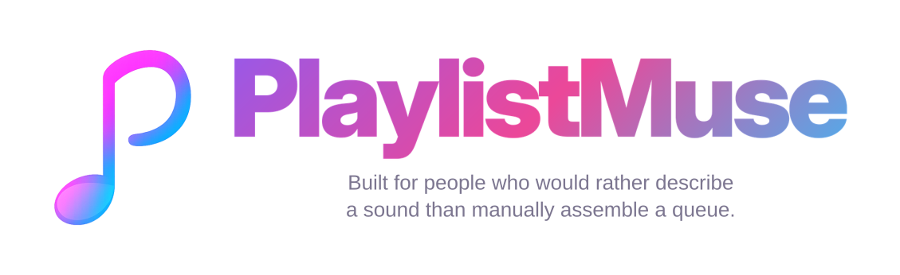

<div align="center">
  

  <br>

  <a href="https://github.com/steventrux/PlaylistMuse/actions/workflows/ci.yml?query=branch%3Adev"></a>
  
  
  
  
  <a href="LICENSE"></a>

  <p>
    Create, refine and publish YouTube Music playlists from a written idea or a reference song.
  </p>

  <p>
    <a href="#playlistmuse-at-a-glance"><strong>Overview</strong></a>
    &nbsp;·&nbsp;
    <a href="#from-idea-to-playlist"><strong>How it works</strong></a>
    &nbsp;·&nbsp;
    <a href="#installation"><strong>Installation</strong></a>
    &nbsp;·&nbsp;
    <a href="#configuration"><strong>Configuration</strong></a>
  </p>
</div>

<br>

> [!CAUTION]
> This is the active development branch. It may contain incomplete or changing functionality and is not published as a Docker image. Use `main` with `ghcr.io/steventrux/playlistmuse:latest` for stable installations or `beta` with `ghcr.io/steventrux/playlistmuse:beta` for public preview builds.

## PlaylistMuse at a glance

PlaylistMuse is a self hosted web application that turns a musical idea into an editable YouTube Music playlist.

Describe a mood, genre, era, activity or journey, or begin with an existing song. PlaylistMuse uses the AI provider you choose, finds matching tracks in the YouTube Music catalogue and prepares a playlist that you can review before publishing.

Last.fm can optionally add listening based discovery signals. Connecting YouTube Music is only required when you want to publish directly from PlaylistMuse.

<table>
  <tr>
    <td width="50%" valign="top">
      <h3>🎵 Create</h3>
      <p>Generate a playlist from a natural language prompt or a seed song, with between 5 and 100 tracks.</p>
    </td>
    <td width="50%" valign="top">
      <h3>✨ Refine</h3>
      <p>Exclude live recordings, covers and remixes, remove duplicates and replace individual songs.</p>
    </td>
  </tr>
  <tr>
    <td width="50%" valign="top">
      <h3>🔎 Discover</h3>
      <p>Use optional Last.fm signals to help the AI find related tracks and artists beyond the most obvious choices.</p>
    </td>
    <td width="50%" valign="top">
      <h3>▶️ Publish</h3>
      <p>Edit the title, review the sequence, create a cover mosaic and publish to YouTube Music with the visibility you prefer.</p>
    </td>
  </tr>
</table>

## From idea to playlist

<table>
  <tr>
    <td width="8%" align="center"><strong>1</strong></td>
    <td><strong>Describe what you want</strong><br>Write a prompt or choose a song as the starting point.</td>
  </tr>
  <tr>
    <td width="8%" align="center"><strong>2</strong></td>
    <td><strong>Let the AI shape the direction</strong><br>The selected provider interprets your request and proposes a coherent sequence. When Last.fm is enabled, it can add related listening signals.</td>
  </tr>
  <tr>
    <td width="8%" align="center"><strong>3</strong></td>
    <td><strong>Match real catalogue tracks</strong><br>PlaylistMuse checks title, artist and album information, removes duplicates and rejects unwanted versions.</td>
  </tr>
  <tr>
    <td width="8%" align="center"><strong>4</strong></td>
    <td><strong>Review and publish</strong><br>Replace songs, edit the title and send the finished playlist to YouTube Music when ready.</td>
  </tr>
</table>

## Installation

> **Development setup**
>
> The `dev` branch is not published as a Docker image. Build it from source to run the current development code.

### Requirements

1. Docker Engine

2. Docker Compose v2

### Build and run

```bash
git clone --branch dev --single-branch https://github.com/steventrux/PlaylistMuse.git
cd PlaylistMuse
cp .env.example .env
docker compose up -d --build
```

Open **http://localhost:5780**.

The initial setup guides you through the required AI provider configuration and the optional YouTube Music connection.

### Update

```bash
git pull --ff-only origin dev
docker compose up -d --build
```

### Stop

```bash
docker compose down
```

## Configuration

<table>
  <tr>
    <th align="left">Service</th>
    <th align="left">Required</th>
    <th align="left">Purpose</th>
  </tr>
  <tr>
    <td><strong>AI provider</strong></td>
    <td>Yes</td>
    <td>Interprets the request and creates the playlist.</td>
  </tr>
  <tr>
    <td><strong>Last.fm</strong></td>
    <td>No</td>
    <td>Adds listening based discovery signals.</td>
  </tr>
  <tr>
    <td><strong>YouTube Music</strong></td>
    <td>No</td>
    <td>Publishes the finished playlist directly to your account.</td>
  </tr>
</table>

### AI provider

Credentials, models and saved profiles are managed from the web interface.

PlaylistMuse supports Google Gemini, OpenAI, Anthropic, OpenRouter, Ollama and OpenAI compatible endpoints.

### Last.fm

Add an API key from the Last.fm settings panel or through `PLAYLISTMUSE_LASTFM_API_KEY` in `.env`.

Playlist generation continues to work normally when Last.fm is not configured.

### YouTube Music

To enable direct publishing:

1. Create or select a project in Google Cloud Console.

2. Enable **YouTube Data API v3**.

3. Configure the OAuth consent screen.

4. Create an OAuth client of type **TVs and Limited Input devices**.

5. Enter the client ID and secret in PlaylistMuse.

6. Select **Connect account** and complete the authorization.

## Data and access

Settings, credentials and authorization data are stored in the persistent `./data` directory.

Back up this directory before moving or updating the installation.

For remote access, use a trusted private network or protect the application with HTTPS and authentication.

## Disclaimer

PlaylistMuse is an independent project and is not affiliated with Google, YouTube or Last.fm.

YouTube Music access relies on third party and Google APIs that may change over time.

## License

PlaylistMuse is released under the [MIT License](LICENSE).
