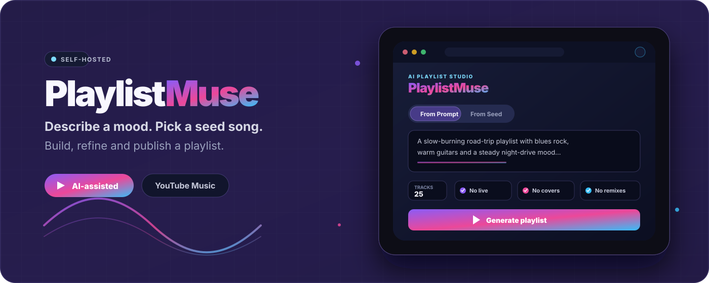
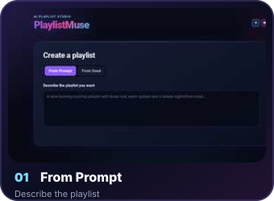
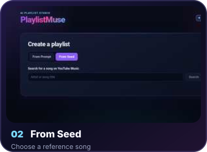
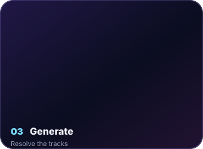
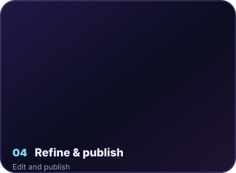
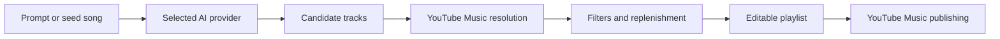

<div align="center">
  

  <br>

  <a href="https://github.com/steventrux/PlaylistMuse/actions/workflows/ci.yml">
    
  </a>
  
  
  
  
  <a href="LICENSE">
    
  </a>

  <p>
    Turn a natural-language idea or a seed song into an editable YouTube Music playlist.<br>
    Refine the result, replace individual tracks and publish it directly from the browser.
  </p>

  <p>
    <a href="#features"><strong>Features</strong></a> ·
    <a href="#quick-start"><strong>Quick start</strong></a> ·
    <a href="#ai-providers"><strong>AI providers</strong></a> ·
    <a href="#youtube-music-publishing"><strong>YouTube Music</strong></a> ·
    <a href="#api"><strong>API</strong></a> ·
    <a href="#development"><strong>Development</strong></a>
  </p>
</div>

<div align="center">
  <p><strong>From an idea to a published playlist</strong></p>
  
  
  
  
</div>

---

## What is PlaylistMuse?

PlaylistMuse is a standalone, self-hosted web application for creating playlists with AI while keeping the final result grounded in the YouTube Music catalogue.

Start from a written prompt or choose a song as the musical reference. PlaylistMuse asks the selected AI provider for candidates, resolves them against YouTube Music, filters unwanted versions and replenishes missing tracks until the requested playlist is complete.

The generated playlist remains editable before publication: review track details, replace individual songs, adjust title and description, choose visibility and send the final sequence directly to YouTube Music.

## Features

| Create | Refine | Publish |
| --- | --- | --- |
| Natural-language prompts | Expandable track details | Google OAuth device authorization |
| Seed-song generation | AI-assisted track replacement | Private, unlisted or public playlists |
| 5–100 requested tracks | Live, cover and remix filters | Direct YouTube Music publishing |
| Multiple AI providers | Catalogue resolution and replenishment | Locally generated cover mosaic |

Additional highlights:

- Provider-specific model discovery based on the configured API or account
- Google Gemini, OpenAI, Anthropic, OpenRouter, Ollama and compatible endpoints
- Persistent profiles for multiple AI providers with instant switching
- OpenRouter Auto and Free routing modes
- Fuzzy YouTube Music matching with duplicate prevention
- Four-tile playlist artwork generated entirely in the browser
- Responsive interface with no frontend framework dependency
- Docker-based self-hosting with persistent application data

## How it works



## Quick start

### Requirements

- Docker Engine
- Docker Compose v2

### Run with Docker Compose

```bash
git clone https://github.com/steventrux/PlaylistMuse.git
cd PlaylistMuse
cp .env.example .env
docker compose up -d --build
```

Open **http://localhost:5780**.

No AI credentials need to be added to configuration files. On the first visit, the browser setup guides you through selecting a provider, entering its API key or server URL and choosing an available model.

To stop the application:

```bash
docker compose down
```

Application settings, provider credentials and YouTube authorization data are stored in the persistent `./data` directory, which is excluded from Git.

## First-run setup

1. Open PlaylistMuse in the browser.
2. Select an AI provider.
3. Enter the provider API key, or the Ollama/compatible server URL when applicable.
4. Refresh and select one of the models reported as available by that provider.
5. Save the provider and make it active.
6. Optionally connect YouTube Music for direct publishing.

Provider credentials and model settings are managed from the web interface. Multiple providers can be configured and switched without editing application files.

## AI providers

| Provider | Model selection | Notes |
| --- | --- | --- |
| Google Gemini | Models reported by the Gemini API | Availability can depend on the API key and Google project |
| OpenAI | Compatible models reported for the account | Non-chat models are excluded from the selector |
| Anthropic | Claude models reported by the API | Availability follows account access |
| OpenRouter Auto | Fixed `openrouter/auto` router | OpenRouter chooses the model automatically |
| OpenRouter Free | Fixed `openrouter/free` router | Uses OpenRouter's free routing pool |
| Ollama | Models installed on the configured server | Embedding-only models are excluded |
| Compatible endpoint | Models reported by an OpenAI-compatible `/models` endpoint | Manual model identifiers remain supported |

The interface displays only the selected primary model. Internal fallback models remain available to the generation pipeline but are intentionally not exposed in the normal settings view.

## YouTube Music publishing

Direct publishing is optional. Playlist generation and editing work without connecting a YouTube account.

To enable publishing:

1. Create or select a project in Google Cloud Console.
2. Enable **YouTube Data API v3**.
3. Configure the OAuth consent screen.
4. Create an OAuth client of type **TVs and Limited Input devices**.
5. Open **YouTube Music Settings** in PlaylistMuse.
6. Save the OAuth client ID and secret.
7. Select **Connect account** and complete Google's device authorization flow.

After connection, the results page can create the edited playlist with **Private**, **Unlisted** or **Public** visibility.

The OAuth client configuration and refreshable account token are stored in the persistent data directory with restricted file permissions. Saved secrets are never returned to the browser.

## Playlist artwork

PlaylistMuse creates a four-tile cover from thumbnails already present in the resolved playlist. Representative tracks are selected from the beginning, middle sections and end of the sequence so the artwork reflects the complete playlist rather than only its opening songs.

Duplicate and blank thumbnails are replaced with other available images. The mosaic is rendered locally in the browser and refreshes immediately after a track replacement.

## Production deployment

PlaylistMuse is intended for trusted, self-hosted environments.

For an internet-facing deployment:

- Place the application behind a reverse proxy.
- Terminate TLS and expose it only through HTTPS.
- Restrict access to trusted users; PlaylistMuse does not provide its own multi-user authentication layer.
- Back up the persistent `data` directory.
- Never commit the data directory, OAuth credentials, provider keys or tokens.
- Keep the container and dependencies updated.

The container listens on port `5780` and exposes `GET /api/health` for health monitoring.

## API

PlaylistMuse exposes a FastAPI application API for the browser interface and optional integrations.

When the application is running locally, FastAPI generates these runtime pages automatically:

- Swagger UI: **http://localhost:5780/docs**
- ReDoc: **http://localhost:5780/redoc**
- OpenAPI schema: **http://localhost:5780/openapi.json**

`/docs` is an HTTP route generated at runtime, not a `docs` directory in the repository.

<details>
<summary><strong>Core endpoints</strong></summary>

### System and configuration

- `GET /api/health`
- `GET /api/settings`
- `PUT /api/settings`
- `GET /api/ai/profiles`
- `POST /api/ai/models`
- `POST /api/ai/activate`
- `DELETE /api/ai/providers/{provider}`

### Playlist creation

- `GET /api/seeds/search`
- `POST /api/playlists/generate`
- `POST /api/playlists/generate-from-seed`
- `POST /api/playlists/replace-track`

### YouTube Music

- `GET /api/youtube/settings`
- `PUT /api/youtube/settings`
- `GET /api/youtube/status`
- `POST /api/youtube/connect/start`
- `POST /api/youtube/connect/poll`
- `DELETE /api/youtube/connection`
- `POST /api/youtube/playlists`

</details>

## Development

### Backend

```bash
python -m venv .venv
source .venv/bin/activate
python -m pip install -r requirements.txt -r requirements-dev.txt
uvicorn backend.main:app --reload --port 5780
```

Open **http://localhost:5780** and complete provider setup from the browser.

### Tests

```bash
python -m compileall -q backend tests
ruff check --select E4,E7,E9,F backend tests
python -m pytest -q

find frontend -maxdepth 1 -name "*.js" -print0 | xargs -0 -n1 node --check
find tests -maxdepth 1 -name "*.cjs" -print0 | xargs -0 -n1 node --check
node --test tests/*.cjs
```

The GitHub Actions workflow runs Python validation, JavaScript validation and a container health smoke test on pushes and pull requests.

## Technology

- **Backend:** Python 3.12, FastAPI, Uvicorn, HTTPX
- **AI integration:** provider-specific REST APIs and OpenAI-compatible endpoints
- **Music catalogue:** `ytmusicapi`
- **Frontend:** semantic HTML, modern CSS and vanilla JavaScript
- **Deployment:** Docker and Docker Compose
- **Quality:** Pytest, Ruff and Node's built-in test runner

## Contributing

Issues and pull requests are welcome. Keep changes focused, preserve the self-hosted architecture and include regression tests for behavior changes.

Before opening a pull request, run the complete Python and JavaScript test suites shown above.

## Disclaimer

PlaylistMuse is an independent project and is not affiliated with Google or YouTube.

`ytmusicapi` is an unofficial YouTube Music client. Google or YouTube may change authentication requirements or internal endpoints without notice.

## License

PlaylistMuse is released under the [MIT License](LICENSE).

<div align="center">
  <sub>Built for people who would rather describe a sound than manually assemble a queue.</sub>
</div>
